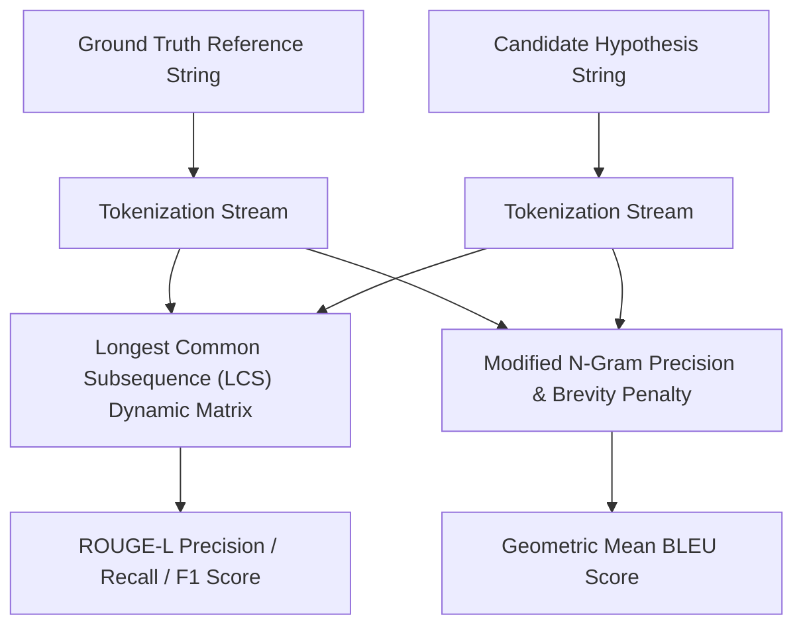

# genpark-rouge-bleu-lexical-overlap-metrics-skill

Agent Skill implementing **Pure Python BLEU & ROUGE-L Lexical Overlap Evaluation** in 100% Python standard library.

## Architectural Flow

```mermaid
flowchart TD
    Ref["Ground Truth Reference String"] --> TokRef["Tokenization Stream"]
    Hyp["Candidate Hypothesis String"] --> TokHyp["Tokenization Stream"]
    TokRef & TokHyp --> LCS["Longest Common Subsequence (LCS) Dynamic Matrix"]
    LCS --> Rouge["ROUGE-L Precision / Recall / F1 Score"]
    TokRef & TokHyp --> NGram["Modified N-Gram Precision & Brevity Penalty"]
    NGram --> Bleu["Geometric Mean BLEU Score"]
```
